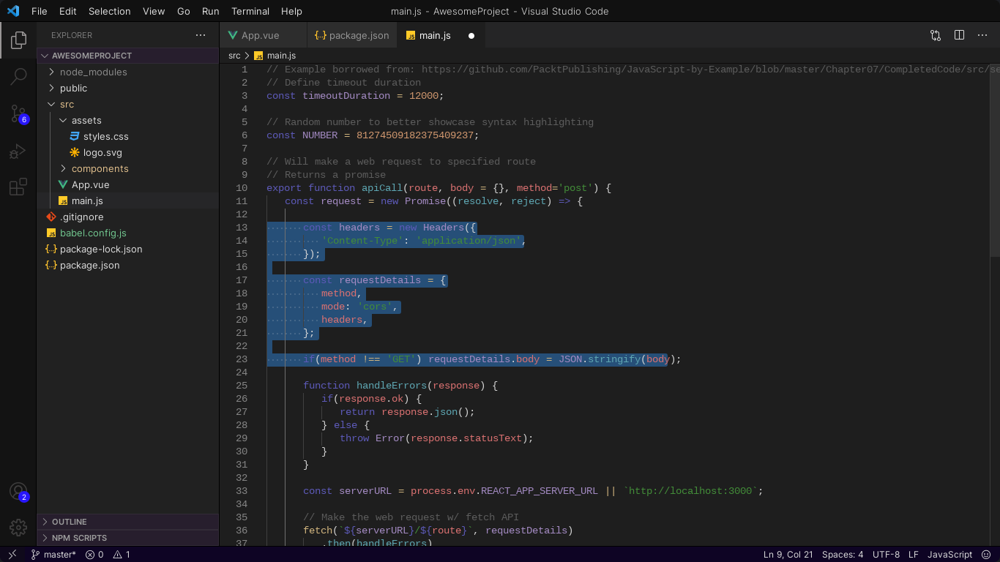
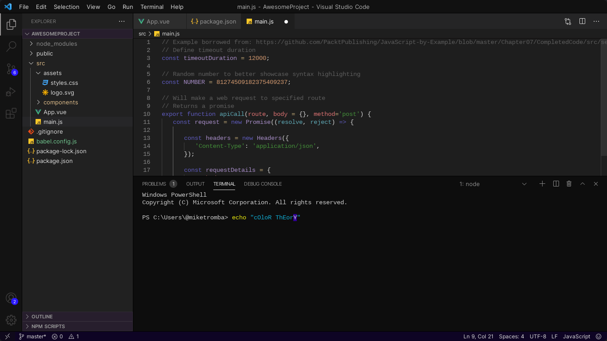
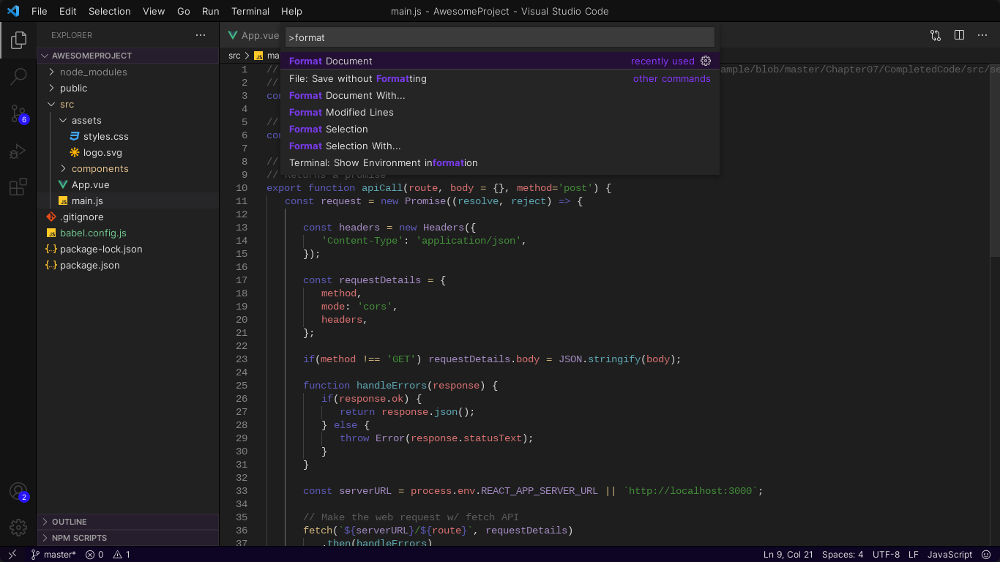

# Calming Indigo
A Soothing Dark Theme for some late night coding.

I was aiming for a theme that could be used during the day time while you are tired. The goal was a theme where none of the elements were excessively bright or saturated; I was looking for colors that would look nice, and colorful, while still being boring.

#### Disclaimer
Calming Indigo is my First Theme.  
I am not familiar with the practices of color theory.  
If you have any tips, please be sure to contact me!

I'm very happy with the way this first one turned out and am interested in further development of more themes, etc.

Any Tips for themes and color theory
[Contact Us](https://backwardsdevelopment.ca/contact)

Checkout our website.  
[Backwards Development](https://backwardsdevelopment.ca/)  
  
Checkout our [GitHub](https://github.com/backwardsdevelopment/)

Product of BackwardsUser and Backwards Development.  
© BackwardsUser (Alexander Harding)